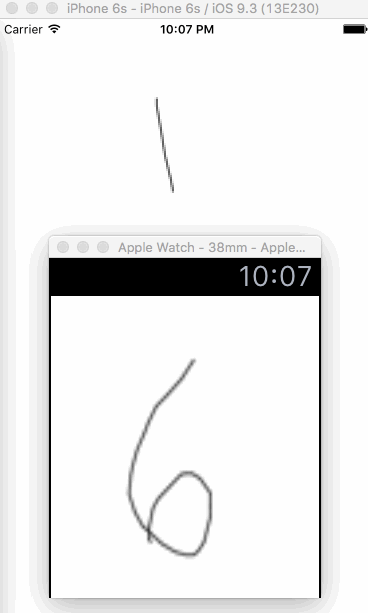

# watchOS-animations-test

Sample working application to show the problems related to [this StackOverflow question](http://stackoverflow.com/questions/36975649/cannot-change-duration-of-animated-dynamic-images-in-watchos-2).

In short: the animation duration is not being recognized by the watch. See [these lines in `watchSample WatchKit Extension/InterfaceController.swift`](watchSample%20WatchKit%20Extension/InterfaceController.swift#L54-80) and [these lines in `watchSample/ViewController.swift`](watchSample/ViewController.swift#L21-30)

This is a screen capture of both iPhone and Watch result (notice the frame rate difference):

